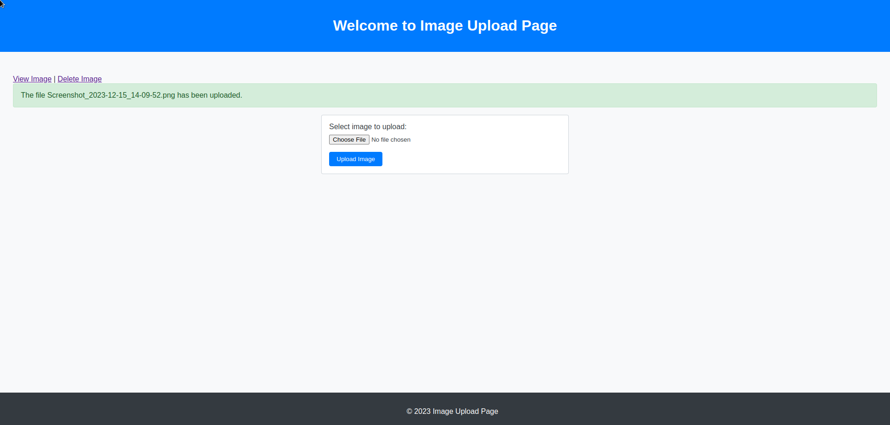
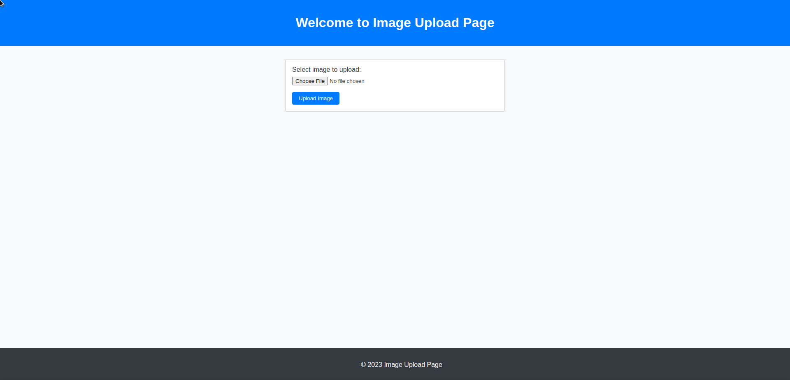

# Image Upload Project

This project is a simple web application that allows users to upload images, view them, and delete them. The application is built using PHP and MySQL.

## Features

- Upload images (JPG, JPEG, PNG, GIF)
- Store image information in a MySQL database
- Display uploaded images
- Delete images using a unique hash key
- Simple and clean user interface

## Requirements

- PHP 7.0 or higher
- MySQL 5.6 or higher
- Web server (e.g., Apache, Nginx)

## Installation

1. Clone the repository to your local machine:
    ```bash
    git clone https://github.com/loka1/simple-upload-center.git
    ```

2. Navigate to the project directory:
    ```bash
    cd image-upload-project
    ```

3. Create a MySQL database and table:
    ```sql
    CREATE DATABASE image_upload;
    USE image_upload;

    CREATE TABLE images (
        id INT AUTO_INCREMENT PRIMARY KEY,
        filename VARCHAR(255) NOT NULL,
        filepath VARCHAR(255) NOT NULL,
        hash VARCHAR(255) NOT NULL,
        uploaded_at TIMESTAMP DEFAULT CURRENT_TIMESTAMP
    );
    ```

4. Update the database connection settings in `index.php`, `view.php`, and `delete.php`:
    ```php
    $servername = "localhost";
    $username = "your_username";
    $password = "your_password";
    $dbname = "image_upload";
    ```

5. Ensure the `uploads` directory exists and is writable:
    ```bash
    mkdir uploads
    chmod 777 uploads
    ```

6. Start your web server and navigate to the project directory in your browser.

## Usage

1. Open the application in your web browser.
2. Use the form to select and upload an image.
3. After uploading, you will see links to view and delete the image.
4. Click "View Image" to see the uploaded image.
5. Click "Delete Image" to remove the image from the server and database.

## Screenshots

### Image 1


### Image 2


## License

This project is licensed under the MIT License. See the [LICENSE](LICENSE) file for details.
